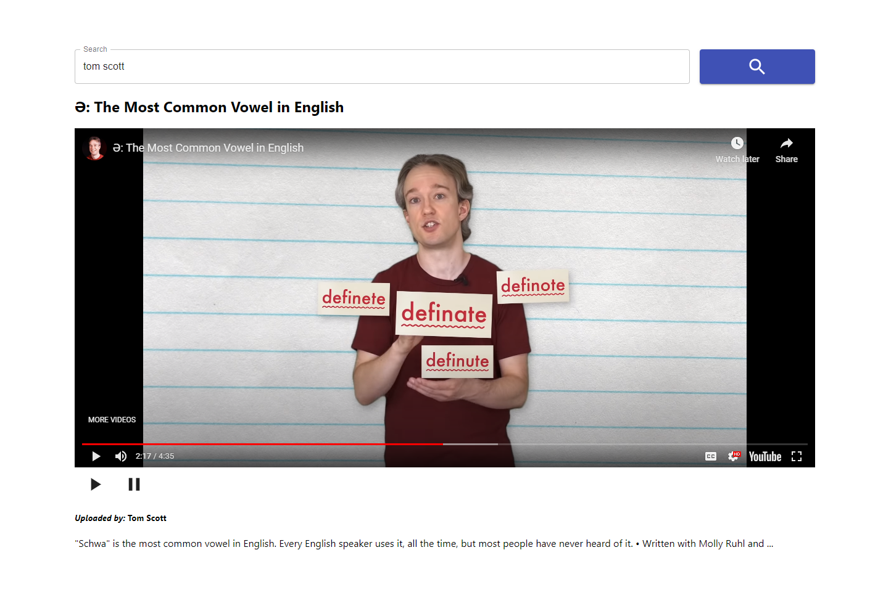

### Single Page Video Player
This is an app which takes a search paramater and gives you the top result from youtube. Made with react.

### Setup
Run `yarn`, and in order to search for youtube videos you have to add a google api key at `REACT_APP_GOOGLE_API` in the `.env` file.
`yarn start` to host locally.
